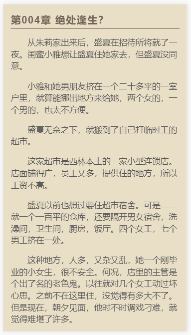
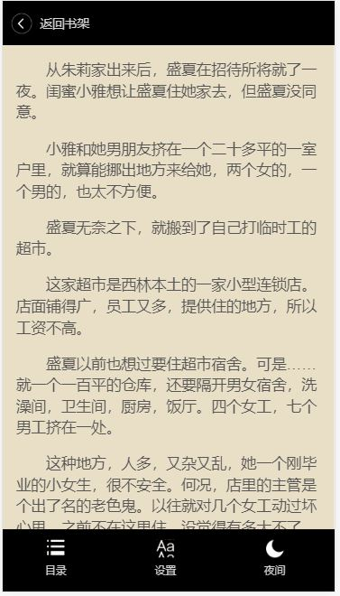
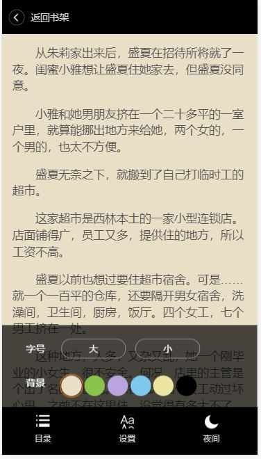

# HTML5-Web-App-Reader
# 基于HTML5 的移动端web 阅读器 #

基本功能类似于一些网站的小说页面  

预览地址：[http://haitang10.top/HTML5-Web-App-Reader/](http://haitang10.top/HTML5-Web-App-Reader/)

技术 localStorage base 64 图片 icon  touch 事件

## 使用base64 格式的图片制作ICON ##
优势：

- 可以减少请求 把图片信息放到css里面，直接加载
- 加快首屏数据的显示速度

缺点：

- 维护不方便

HTML5 新增API
DOM 操作 querySelector
本地数据缓存
获取位置，事件等API

## 性能优化: ##
  减少repaint, reflow
  尽量缓存所有可以缓存的数据 cookie localStorage
  使用css3 transform 代替DOM 节点操作  animate.使用css
  不要给非static 元素加 动画transform
  适当使用硬件加速
## 移动端： ##
 轻量化 高性能 维护简单 高性能
原生 js 框架

# 开发过程：

-  页面结构搭建, 主体结构，边栏，导航栏（目录，设置，夜间）

- 交互 返回操作 翻页操作 设置字号和背景，同时记忆设置好的内容

1. 存储and获取数据,又是一个闭包，把变量隐藏起来，只暴露两个方法
5. 页面初始化时从localStorage中读取字体大小，如果没有设为14,这里需要一个全局变量，并且在点击增大减小按钮时都要修改其值
6. 页面初始化时要从localStorage中读取背景颜色信息
2. 实现和阅读器相关的数据交互的方法
    1. 从chapter.json获得章节列表信息
    2. 同时回调函数，通过chapter_id用于获得章节内容地址，
    3. 通过chapter_id用于获得章节内容地址这个函数自身还有一个回调，即通过jsonp请求获取真正的内容数据。
    4. 获得章节内容函数同样有回调，即渲染章节内容UI结构
    5. 总之，凡是ajax请求获取数据都有回调，回调套回调，callback hell！！！
    6. 目录列表采用absolute 定位，点击目录时弹出。在获取章节列表信息后调用回调函数。
  
3. todo 渲染基本的UI结构
4. todo 交互事件绑定
	 1. 轻触屏幕唤出边栏，增加结构,如果边栏被隐藏就显示，显示就隐藏两种方式，用zepto 库和原生js 原理一样，就是写法不同而已。
   	注意jquery库无法添加addEventListener
	2. 唤出设置字体大小和背景
	3. 唤出目录
	4. 屏幕滚动
	5. 切换背景，就是一个轮播图
	6. 切换夜间模式

# 注意事项：

## 1. 行内元素沿基线对齐，所以让图片居中用vertical-align 垂直对齐

          .bk_container{
  				position:relative;
  				width: 30px;
  				height: 30px;
  				border-radius: 15px;
  				background: #fff;
  				display: inline-block;
  				vertical-align: -14px;
## 2. 出现bug

        var initFonSize = Utli.StorageGetter('font_size')
        if(!initFonSize){
          initFonSize = 14
        }
        initFonSize = parseInt(initFonSize)
        //设置字体大小
        log('字体大小', Utli.StorageGetter('font_size'))
        Dom.content_size.css('font-size', initFonSize)

        上述代码用函数封装之后出现bug
        var initFonSize = Utli.StorageGetter('font_size')
        var setFont = function() {

          if(!initFonSize){
            var initFonSize = 14
          }
          var initFonSize = parseInt(initFonSize)
          //设置字体大小
          log('字体大小', Utli.StorageGetter('font_size'))
          Dom.content_size.css('font-size', initFonSize)
        }

        setFont()      
        出现bug 原因是在已经声明了全局变量initFonSize,所以在函数内部就不要再用var
        声明变量了，这样容易声明一个局部变量，导致和全局变量冲突，无法对全局变量修改
        所以全局变量声明一次就可以，因为js有作用域链，函数内部可以访问全局变量

## 3. 未解决bug -切换背景时点击不准确，因为把事件绑在了五个背景图的父元素上 ，

	    父元素是一个div容器，不是精确的圆，解决办法
	    响应事件时判定点击的是否是五个小圆，如果点击的是圆，则 event.target.id 为真
	    if(event.target.id)

## 4. 实现和服务端数据交互，全是异步操作，回调套回调，嵌套层次很深。

				1.先通过ajax得到章节列表信息，
			  	2.通过回调函数根据id获得章节内容地址，地址有jsonp字段，值为地址，
			  	3.又一个回调函数，再通过jsonp跨域获得章节内容。
				4. 再一个回调，将得到的内容用于渲染UI结构

这就导致了一个问题：代码可读性非常差，并且维护性不好。所以就有了一个问题，如何组织js异步代码？

## 避免嵌套过深：
	
- 事件消息通知
-  ES6 Promise 
-  generator

在使用了ES6 Promise对象组织了代码后，改写
	
      var getFictionInfoPromise = function(){
          return new Promise(function(resolve, reject){
                     $.get('data/chapter.json',function(data){
                        if(data.rsult == 0){
                            Chapter_id = Utli.StorageGetter('last_chapter_id')
                            if(Chapter_id == null){
                                Chapter_id = data.chapters[1].chapter_id
                            }
                            Chapter_total = data.chapters.length
                            resolve()
                        }
                        else{
                            reject()
                        }

                     },'json')

                })
       }

调用的时候 

      var init3 = function(UIcallback){
          getFictionInfoPromise().then(function(data){
              return getCurChapterContentpPromise()
          }).then(function(data){
              UIcallback && UIcallback()
          })
      }
